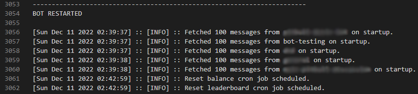

# MackaysMemeMachine
Discord bot for score keeping based on custom emoji reactions. Work in progress. Please provide credit if you fork the project

## How it works

The bot is primarilly built with node, [discord.js](https://discord.js.org/#/) and [Sequelize](https://sequelize.org).

Additionally it uses the [cron package](https://www.npmjs.com/package/cron) to schedule and run cron jobs and the [ascii-table3 package](https://www.npmjs.com/package/ascii-table3) to format tables.

## Features

+ Score keeping based on two custom emoji (configurable) reactions
+ A limited balance of points to be given or taken away, by each user, per day
+ Cron jobs to reset users balance per day or to assign, and record, a winner for the month and reset the scoreboard
+ An outputable monthly scoreboard & overall leaderboard
+ The ability to mute the bot
+ Error & Info logging
+ Debug mode with increased logging and the ability to react to your own messages

### Scoreboard

### Leaderboard

### Console & Logging

## Limitations

As this project was designed as a side project both to learn node and for fun it is has several limitations. 

The bot is not intended for use on multiple servers and must have a primary server and admin assigned in the config. The database schema also makes no distinction between servers. This means users balances, scoreboards and the monthly leaderboard are all shared between servers. 

The bot is not set up to be distributed. If you wish to use or fork the bot then a config.json file must be provided following the configTemplate.json structure.

## Setup

1. Create a config.json file matching the format of the configTemplate.json
2. [Setup a bot application in the discord developer portal](https://discordjs.guide/preparations/setting-up-a-bot-application.html#creating-your-bot) so that you have an api token. Some familarity with discord bot permissions will be needed
3. [Add the bot to your server](https://discordjs.guide/preparations/adding-your-bot-to-servers.html#bot-invite-links)
4. Run the dbInit script
5. Run the deployCommands script
6. Navigate to the root directory and run 'node .'
